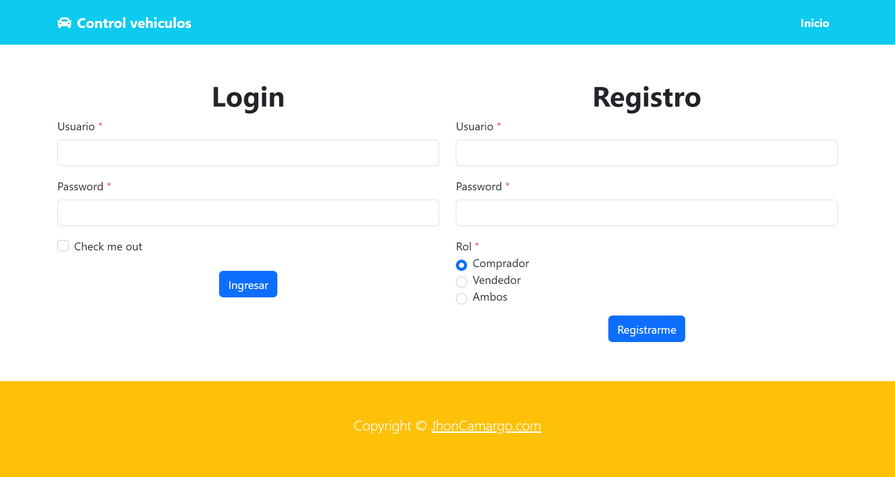

# Control de vehiculos

Programa para el control de vehiculos, registro y muestra de estos.

**Previsualizacion**

## Notas importantes

* **Se trabaja con la versión 12.5 de Apache Netbeans**
* **Se debe ejecutar todo el archivo de la base de datos para que se cree el usuario administrador**
* **Si en su MySQL tiene una contraseña, se debe corregir el archivo de la Conexion, reemplazando el archivo Conexion.java (url: manejo_vehiculos/src/main/java/util)**
* **Preferiblemente al registrar usuarios, ingresar correos validos para que no se retorne el correo que se envía**

By: [Jhon Camargo](https://jhoncamargo.000webhostapp.com/)